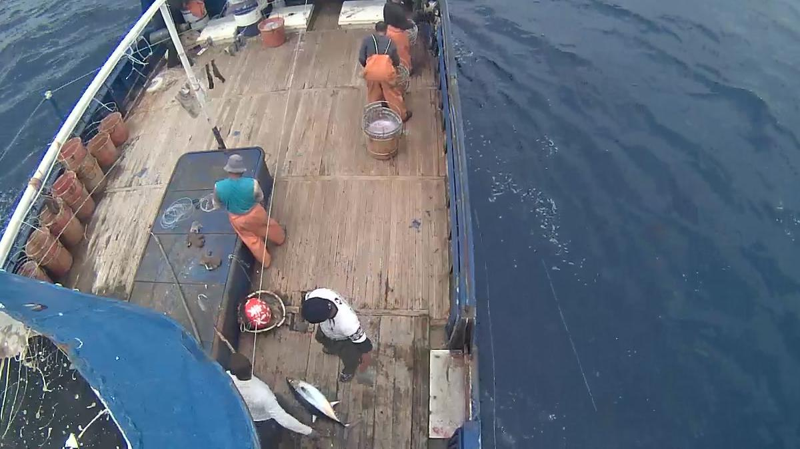

# Fishnet Object Detection
Module Project 1: AIPI 540 - Using deep learning methods to classify and bound fish in images of commerical fishing scenes.

This project aims to leverage computer vision techniques to detect fish species and humans on commerical fishing vessels, utilizing a fine-tuned Faster R-CNN model for accurate object detection. By identifying different species and human activities, the system seeks to promote sustainable fishing practices and ensure regulatory compliance. The initiative represents a critical step towards leveraging AI in environmental conservation, offering a scalable solution to monitor and manage fishing activities effectively.

## To Use

Set these in .env
FLASK_ENV=development
FLASK_APP=app

Then just:
flask run
