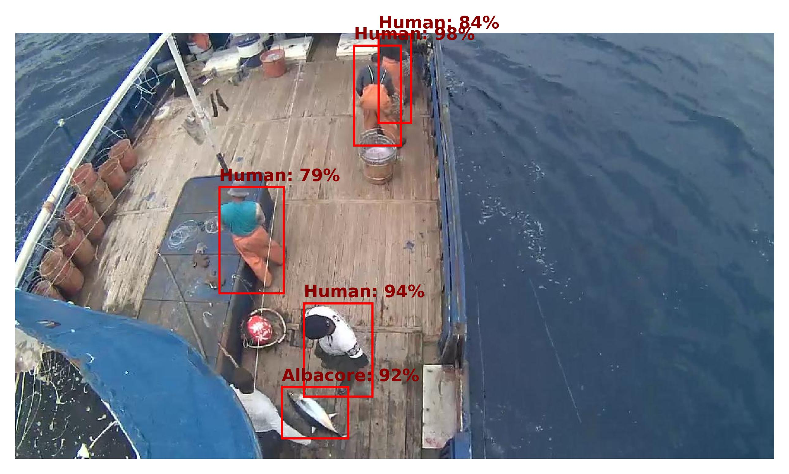

# Fishnet Object Detection
Module Project 1: AIPI 540 - Using deep learning methods to classify and bound fish in images of commerical fishing scenes.

<table>
  <tr>
    <td>
      
    </td>
    <td>
      
    </td>
  </tr>
</table>

This project aims to leverage computer vision techniques to detect fish species and humans on commerical fishing vessels, utilizing a fine-tuned Faster R-CNN model for accurate object detection. By identifying different species and human activities, the system seeks to promote sustainable fishing practices and ensure regulatory compliance. The initiative represents a critical step towards leveraging AI in environmental conservation, offering a scalable solution to monitor and manage fishing activities effectively.

## Methods
The project uses a Faster R-CNN model to identify and classify fish species and humans in images of commercial fishing scenes. The model is pretrained on the COCO dataset and finetuned on the Fishnet dataset (https://www.fishnet.ai/download) to improve performance. The model can be used to detect and classify humans and fish species in images, providing valuable insights into commercial fishing activities and promoting sustainable practices.

## To Use

1. Create a .env file in the root directory with the following variables:
```
FLASK_ENV=development
FLASK_APP=app
```
2. Create a virtual python environment.
```
python -m venv venv
```
3. Activate the virtual environment:
```
source venv/bin/activate   (for Mac)
OR
venv\Scripts\activate   (for Windows)
```
4. Install the required packages:
```
pip install -r requirements.txt
```
5. Run the Flask app from the root directory:
```
flask run
```

## Repository Structure
```
├── app
│   ├── static
│   ├── templates
├── data
├── data-preprocessing
├── models
├── notebooks
├── scripts
├── .dockerignore
├── .gitignore
├── Dockerfile
├── README.md
├── requirements.txt
```
The Flask app is located in the app directory, which contains the static and templates directories for storing images and HTML templates, respectively. 

The data directory contains the parsed labels, model results, and a handful of test images. The dataset used can be found at https://www.fishnet.ai/download. 

The data-preprocessing directory contains the scripts used to preprocess the Fishnet dataset. 

The models directory contains the pretrained and fine-tuned Faster R-CNN models. 

The notebooks directory contains the Jupyter notebooks used for data exploration and inital model training.

The scripts directory contains the scripts used to train the model (`train.py`), test the model (`testing.py`), create the custom dataset (`custom_dataset.py`), construct the final model class (`fishnet_detector.py`), construct the RF model (`traditional_object_detection.py`), and more.
